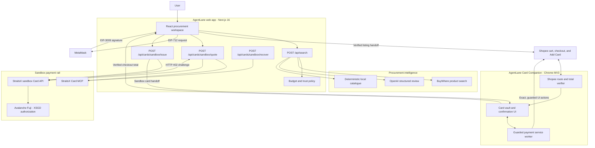

# AgentLane

**An AI procurement agent that turns a shopping request into a verified, policy-bounded checkout using XSGD and a browser companion.**

AgentLane finds and ranks Singapore marketplace listings, hands the user to Shopee, verifies the merchant's final checkout total, issues a non-spendable StraitsX sandbox Visa through an x402 flow, and helps carry that card back into checkout. The user stays in control of product selection, wallet authorization, card choice, and final payment confirmation.

> Hackathon status: end-to-end prototype using Shopee's live UI, StraitsX sandbox card infrastructure, MetaMask, and Avalanche Fuji. Sandbox cards cannot spend real money.

## The problem

Commerce agents are good at recommending products but usually stop before the difficult part: confirming the live merchant price, respecting a spending policy, obtaining payment authorization, and safely completing a browser checkout.

AgentLane closes that gap with a checkout-first design:

- recommendations are grounded in live marketplace data when BuyWhere is configured;
- the card value comes from Shopee's rendered **final checkout total**, not an earlier discovery price;
- issuance is capped by both user policy and the sandbox provider limit;
- MetaMask signs a time-limited EIP-3009 authorization for the x402 challenge;
- the extension has narrow Shopee-only permissions and keeps final order submission behind an explicit confirmation.

## What it does

1. The user describes what they want and sets a budget.
2. AgentLane searches live Singapore listings through BuyWhere, optionally uses OpenAI structured outputs to review request fit, and applies deterministic trust and budget rules.
3. The user opens the chosen Shopee listing. A recent AgentLane handoff arms the Card Companion.
4. If Shopee lands on `/cart` with items already selected, the extension activates the exact **Check Out** control once. It never selects products or changes quantities.
5. On `/checkout`, the extension captures Shopee's labeled final total and opens its card picker.
6. The user can select any stored AgentLane test card, including a low-balance card with a visible warning, or return the verified total to AgentLane to create a checkout-sized card.
7. AgentLane obtains an x402 challenge, asks MetaMask for an EIP-712 `TransferWithAuthorization` signature, and requests a StraitsX Fuji sandbox Visa.
8. Card Companion fills only card number, expiry, CVV, and cardholder name on Shopee's secure Add Card page. Billing fields are untouched.
9. The extension re-checks the total and requires a final **Confirm and pay** action before it can activate Shopee's exact **Place Order** control.

## Architecture



### Component responsibilities

| Component | Responsibility |
|---|---|
| Next.js app | Procurement UI, budget controls, checkout-total handoff, and card issuance experience |
| `/api/search` | Selects live, AI-assisted, or deterministic search mode; never silently substitutes demo products for a failed live BuyWhere request |
| Policy layer | Enforces the user ceiling, S$30 provider ceiling, estimated-fee reserve, and deterministic offer ranking/trust checks |
| Card quote route | Calls `get_card_sandbox` through MCP, validates the returned Card API URL, and extracts the x402 requirement from the HTTP 402 response |
| Browser wallet flow | Switches to Avalanche Fuji and signs an EIP-712 `TransferWithAuthorization` payload without sending the wallet signature to the extension |
| Card issue route | Forwards the signed x402 payment authorization to the StraitsX sandbox Card API |
| Chrome extension | Tracks Shopee's client-side routes, captures the authoritative total, stores up to five sandbox cards, and performs narrowly scoped checkout actions |
| Recovery route | Recovers a sandbox card using its opaque ID, Fuji settlement transaction, and issuing wallet through `view_card_sandbox` |

## Why it is hackathon-worthy

- **Real last-mile orchestration:** the prototype crosses the boundary between an agent UI, a live merchant site, a wallet, an MCP server, and a payment API.
- **Price integrity:** card issuance is based on the merchant's checkout total after vouchers and shipping, not a potentially stale search price.
- **Layered guardrails:** budget checks run during search, quote creation, and issuance; the worker verifies the total again before payment actions.
- **Human control at meaningful boundaries:** the user chooses the product, authorizes XSGD, chooses the card, and confirms the final order action.
- **Graceful demo modes:** the procurement UI still works with AI simulation or a deterministic local catalogue when live discovery credentials are unavailable.

## Tech stack

- Next.js 16.3 and React 19
- TypeScript and Tailwind CSS 4
- OpenAI Responses API with strict structured outputs
- BuyWhere Singapore product search
- Model Context Protocol SDK over SSE
- StraitsX sandbox Card API and x402 challenge flow
- MetaMask with EIP-712 / EIP-3009 authorization
- Avalanche Fuji for sandbox settlement
- `viem` for EVM validation and token reads
- Chrome Extension Manifest V3

## Run the demo

- Landing page: [https://straitsx-hackathon.vercel.app](https://straitsx-hackathon.vercel.app)
- Live procurement agent: [https://straitsx-hackathon.vercel.app/agent](https://straitsx-hackathon.vercel.app/agent)

> **Chrome extension required:** Before trying the full checkout demo, please install the AgentLane Card Companion by following the [Load Card Companion](#3-load-card-companion) steps below. The extension verifies Shopee's final checkout total and connects the browser checkout flow back to AgentLane.

### Prerequisites

- Node.js 20+
- Chrome 127+
- MetaMask
- A wallet prepared for the StraitsX Avalanche Fuji sandbox flow
- Optional: OpenAI and BuyWhere API keys for the strongest live demo

### 1. Configure the app

```bash
npm install
cp .env.example .env.local
```

```dotenv
OPENAI_API_KEY=your_openai_project_key
OPENAI_MODEL=gpt-5.6-luna
BUYWHERE_API_KEY=your_buywhere_key
USER_TRANSACTION_LIMIT_SGD=30

# Optional override; the repository already has a sandbox default.
CARD_MCP_SANDBOX_URL=https://card.straitsx.ai/sandbox/sse
```

Environment behavior:

| Configuration | Search behavior |
|---|---|
| BuyWhere + OpenAI | Live Singapore listings reviewed for request fit by OpenAI |
| BuyWhere only | Live listings ranked with deterministic local logic |
| OpenAI only | Clearly labeled AI procurement simulation |
| Neither | Deterministic local demo catalogue |

`OPENAI_API_KEY` is server-only. Never expose it through a `NEXT_PUBLIC_` variable or commit `.env.local`.

### 2. Start AgentLane on port 3001

The Card Companion returns production handoffs to `https://straitsx-hackathon.vercel.app/agent`. Localhost remains accepted while developing the extension.

```bash
npm run dev -- --port 3001
```

Open [http://localhost:3001/agent](http://localhost:3001/agent).

### 3. Load Card Companion

1. Open `chrome://extensions`.
2. Enable **Developer mode**.
3. Choose **Load unpacked**.
4. Select the repository's `chrome-extension` directory.
5. After changing extension code, use **Reload** on its extension card.

The extension requests only:

- `activeTab`, `scripting`, and `storage`;
- host access to `https://shopee.sg/*` and `https://pay.shopee.sg/*`.

### 4. Suggested judge demo

1. Connect MetaMask in AgentLane.
2. Ask for a low-cost item, for example: `Find a wireless mouse on Shopee under S$20`.
3. Open the top recommendation and choose the intended Shopee variant.
4. Continue into Shopee's cart. With selected items and a recent handoff, Card Companion continues to checkout.
5. Show that the captured total reflects Shopee vouchers, shipping, and quantity.
6. Choose **Purchase now**, review the checkout-sized XSGD value, and sign the Fuji authorization in MetaMask.
7. Capture the issued sandbox card with Card Companion.
8. Return to Shopee, select the card, and demonstrate the Add Card automation.
9. Stop before final order submission unless the demo explicitly calls for testing the sandbox confirmation path.

## Safety and trust boundaries

- Sandbox cards are non-spendable and cannot purchase real goods.
- Checkout captures expire after 30 minutes; cart takeover expires after 10 minutes.
- Cart takeover is armed only by a recent AgentLane handoff and never selects items or changes quantity.
- Card details stay in extension storage, are masked by default, and are never written to the console.
- Shopee-saved card details are not copied into extension storage; only visible labels and last four digits are used for selection.
- The extension does not retain recipient names, addresses, or postal codes.
- Add Card automation leaves Shopee's billing address fields untouched.
- Low-balance sandbox cards remain selectable for test coverage but are clearly marked `LOW`.
- The x402 wallet signature is sent to the server-side issuance route, not stored by the extension.
- Live-search failures are surfaced as errors when BuyWhere is configured; fabricated fallback products are not presented as live results.

## API surface

| Route | Purpose |
|---|---|
| `POST /api/search` | Parse intent, enforce budget, fetch/rank listings, and return at most three offers |
| `POST /api/cards/sandbox/quote` | Validate amount and wallet, call Card MCP, and return the x402 payment requirement |
| `POST /api/cards/sandbox/issue` | Validate and forward the signed x402 authorization to the sandbox Card API |
| `POST /api/cards/sandbox/recover` | Recover an issued sandbox card through Card MCP references |

## Repository map

```text
src/app/                         Next.js UI and API routes
src/components/CommerceWorkspace.tsx
                                 Main procurement and issuance experience
src/lib/openai-procurement.ts     Structured AI simulation and live-listing review
src/lib/buywhere-listings.ts      Live marketplace adapter and normalization
src/lib/budget.ts                 User/provider issuance policy
src/lib/x402.ts                   Wallet challenge and EIP-3009 signing flow
src/lib/card-mcp.ts               StraitsX MCP client
chrome-extension/                 Shopee verifier, popup, and payment worker
scripts/                          MCP probes and extension validation
```

## Verification

```bash
npm run lint
npm run build
npm run validate:extension
```

Useful sandbox probes:

```bash
node scripts/inspect-card-mcp.mjs
node scripts/probe-x402-sandbox.mjs
```

## Known limitations

- Shopee is a third-party SPA; DOM and payment-flow changes can require selector updates.
- Programmatic extension popups require Chrome 127 or newer.
- The extension is currently scoped to Shopee Singapore.
- Card issuance uses Avalanche Fuji, while the header wallet balance widget currently reads the configured Avalanche C-Chain XSGD token address; treat the issuance panel and Fuji settlement link as the authoritative sandbox proof.
- The demo intentionally does not autonomously choose products, change cart contents, or bypass wallet and final-payment confirmations.

## Project status

AgentLane is a hackathon prototype, not production financial software. It demonstrates how an agent can coordinate discovery, policy, payment authorization, and browser checkout while preserving explicit user control and auditable boundaries.
