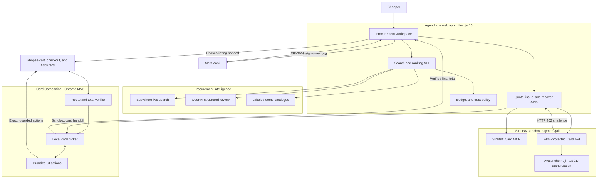

# AgentLane

> **Judges: install the [AgentLane Card Companion](#install-the-card-companion) for the full end-to-end experience.** The Chrome extension connects AgentLane to Shopee so you can evaluate live checkout-total verification, sandbox card handoff, secure card filling, and the final human confirmation step.

> An AI procurement agent that takes a shopping request from discovery to a verified, policy-bounded checkout using XSGD, x402, and a browser companion.

AgentLane is our answer to a missing piece in agentic commerce: recommendations are easy, but safely crossing the last mile into a real merchant checkout is not.

The product finds and ranks Singapore marketplace listings, hands the shopper to Shopee, verifies the merchant's final checkout total, creates a checkout-sized StraitsX sandbox Visa, and helps return that card to checkout. The shopper remains in control of product selection, wallet authorization, card choice, and final payment confirmation.

> **Hackathon prototype:** AgentLane uses Shopee's live interface, StraitsX sandbox card infrastructure, MetaMask, and Avalanche Fuji. The issued sandbox cards cannot spend real money.

## Judge quick start

| | Link |
|---|---|
| Product overview | [straitsx-hackathon.vercel.app](https://straitsx-hackathon.vercel.app) |
| Live procurement agent | [straitsx-hackathon.vercel.app/agent](https://straitsx-hackathon.vercel.app/agent) |
| Full checkout experience | Requires the [AgentLane Card Companion](#install-the-card-companion) |

If you have only a minute, try this:

1. Open the live procurement agent and connect MetaMask.
2. Enter `Find a wireless mouse on Shopee under S$20`.
3. Review how AgentLane explains and ranks up to three policy-compliant results.
4. Open a Shopee result and continue to checkout with the Card Companion installed.
5. Compare the discovery price with the total captured from Shopee after shipping, quantity, and vouchers.
6. Return that verified total to AgentLane and inspect the checkout-sized XSGD authorization request.

The key proof point is not simply that AgentLane finds a product. It carries verified merchant state across the web app, Shopee, MetaMask, and StraitsX without hiding the risky decisions from the shopper.

## The problem we solve

Most commerce agents stop at a recommendation or rely on an early listing price. That leaves the hardest questions unanswered:

- Did shipping, quantity, or a voucher change the real amount due?
- Is the payment still within the shopper's policy?
- What exactly is the wallet authorizing?
- Can an agent help at checkout without silently placing an order?
- How does context move safely between an agent and a third-party merchant?

AgentLane treats checkout as a guarded workflow instead of a single autonomous action. It grounds discovery in marketplace data, reads the final total from the merchant, sizes payment to that total, and asks for explicit approval at each consequential boundary.

## How the product works

1. **Describe the intent.** The shopper states what they need and sets a maximum budget.
2. **Compare compliant options.** AgentLane searches Singapore listings through BuyWhere, optionally reviews fit with OpenAI structured outputs, and applies deterministic budget and trust rules.
3. **Choose on the merchant site.** The shopper opens the selected Shopee listing and remains responsible for the product variant, quantity, and cart contents.
4. **Verify the amount due.** Card Companion reads Shopee's labeled final checkout total rather than trusting the earlier discovery price.
5. **Authorize only that amount.** AgentLane obtains an x402 challenge and asks MetaMask to sign a time-limited EIP-3009 authorization on Avalanche Fuji.
6. **Create and return the card.** StraitsX issues a non-spendable sandbox Visa sized for checkout. Card Companion stores it locally and fills only the secure card fields.
7. **Keep the final decision human.** AgentLane re-checks the total and requires an explicit **Confirm and pay** action before activating Shopee's exact **Place Order** control.

## Why AgentLane stands out

- **It completes the last-mile orchestration.** One workflow connects an AI agent, a live merchant interface, a browser extension, a wallet, an MCP server, and a payment API.
- **It uses the authoritative checkout price.** Card value is derived from Shopee's rendered final total after shipping and vouchers, not a potentially stale listing price.
- **It makes payment policy executable.** Budget checks run during search, quote creation, issuance, and again before the final merchant action.
- **It keeps autonomy bounded.** The extension can perform narrowly defined UI actions, but it does not choose products, alter quantities, fill billing details, or bypass wallet and payment confirmations.
- **It fails honestly.** Live-search errors stay visible when BuyWhere is configured; demo results are clearly labeled instead of being presented as live listings.
- **It remains demonstrable without every credential.** AI simulation and a deterministic local catalogue provide explicit fallback modes for product exploration.

## What to look for during judging

| Evaluation area | Evidence in the prototype |
|---|---|
| Product usefulness | A natural-language request becomes a short, explainable set of purchasable options |
| StraitsX integration | The app requests a sandbox card through Card MCP and the x402-protected Card API |
| Onchain authorization | MetaMask signs an EIP-712 `TransferWithAuthorization` payload for XSGD on Avalanche Fuji |
| Price integrity | The extension captures Shopee's final labeled total and passes only that checkout context back to AgentLane |
| Safety | User and provider limits, quote expiry, route checks, total re-verification, and explicit confirmations are visible in the flow |
| Human control | The shopper chooses the listing, signs the authorization, selects the card, and confirms the final order action |
| Technical depth | Next.js, structured AI output, MCP, x402, EIP-3009, a Chrome MV3 extension, and third-party SPA coordination work as one system |

## Architecture



### System responsibilities

| Component | Responsibility |
|---|---|
| Next.js app | Procurement UI, budget controls, verified-total handoff, and card issuance experience |
| Search API | Chooses live, AI-assisted, or deterministic search mode and returns no more than three ranked offers |
| Policy layer | Enforces the shopper ceiling, S$30 provider ceiling, estimated-fee reserve, and deterministic trust checks |
| Card quote API | Calls `get_card_sandbox` through MCP, validates the returned Card API URL, and extracts the x402 requirement from the HTTP 402 response |
| Browser wallet flow | Switches to Avalanche Fuji and signs an EIP-712 `TransferWithAuthorization` payload |
| Card issue API | Validates and forwards the signed x402 payment authorization to the StraitsX sandbox Card API |
| Card Companion | Tracks Shopee's client-side routes, captures the final total, stores up to five sandbox cards, and performs narrowly scoped checkout actions |
| Recovery API | Recovers a card using its opaque ID, Fuji settlement transaction, and issuing wallet |

## Safety model

AgentLane is intentionally designed so a successful demo also exposes its boundaries:

- Sandbox cards are non-spendable and cannot purchase real goods.
- Checkout captures expire after 30 minutes; cart handoffs expire after 10 minutes.
- A cart handoff is armed only by a recent AgentLane listing selection.
- The extension never selects products, changes quantities, or fills billing-address fields.
- Card details remain in extension storage, are masked by default, and are never logged.
- Saved Shopee card details are not copied into extension storage; only visible labels and last four digits are used for selection.
- The extension does not retain recipient names, addresses, or postal codes.
- Low-balance sandbox cards remain available for test coverage but carry a visible `LOW` warning.
- The x402 wallet signature goes only to the server-side issuance API and is not stored by the extension.
- A final, explicit confirmation is required before the extension can activate **Place Order**.

## Suggested full demo

1. Install the Card Companion using the instructions below.
2. Connect MetaMask in AgentLane.
3. Ask for a low-cost product, such as `Find a wireless mouse on Shopee under S$20`.
4. Open the preferred recommendation and choose the intended variant on Shopee.
5. Continue to the cart. With selected items and a recent handoff, Card Companion can activate Shopee's exact **Check Out** control once.
6. At checkout, show that the captured total includes shipping, vouchers, and quantity.
7. Choose **Purchase now**, review the checkout-sized XSGD value, and sign the Fuji authorization in MetaMask.
8. Capture the issued sandbox card with Card Companion.
9. Return to Shopee, choose the card, and demonstrate the secure Add Card flow.
10. Stop before final order submission unless you specifically want to inspect the sandbox confirmation path.

## Run locally

### Prerequisites

- Node.js 20+
- Chrome 127+
- MetaMask
- A wallet prepared for the StraitsX Avalanche Fuji sandbox flow
- Optional: OpenAI and BuyWhere API keys for the strongest live discovery experience

### Configure AgentLane

```bash
npm install
cp .env.example .env.local
```

```dotenv
OPENAI_API_KEY=your_openai_project_key
OPENAI_MODEL=gpt-5.6-luna
BUYWHERE_API_KEY=your_buywhere_key
USER_TRANSACTION_LIMIT_SGD=30

# Optional override; the repository already provides this sandbox default.
CARD_MCP_SANDBOX_URL=https://card.straitsx.ai/sandbox/sse
```

Search behavior is explicit for every credential combination:

| Configuration | Behavior |
|---|---|
| BuyWhere + OpenAI | Live Singapore listings reviewed for request fit by OpenAI |
| BuyWhere only | Live listings ranked with deterministic local logic |
| OpenAI only | Clearly labeled AI procurement simulation |
| Neither | Deterministic local demo catalogue |

`OPENAI_API_KEY` is server-only. Do not expose it through a `NEXT_PUBLIC_` variable or commit `.env.local`.

### Start the app

Card Companion accepts localhost during development and returns production handoffs to the deployed agent.

```bash
npm run dev -- --port 3001
```

Open [localhost:3001/agent](http://localhost:3001/agent).

### Install the Card Companion

1. Open `chrome://extensions` in Chrome.
2. Enable **Developer mode**.
3. Select **Load unpacked**.
4. Choose this repository's `chrome-extension` directory.
5. After changing extension code, select **Reload** on the extension card.

The extension requests only `activeTab`, `scripting`, and `storage`, plus host access to `https://shopee.sg/*` and `https://pay.shopee.sg/*`.

## Tech stack

- Next.js 16.3, React 19, TypeScript, and Tailwind CSS 4
- OpenAI Responses API with strict structured outputs
- BuyWhere Singapore product search
- Model Context Protocol SDK over SSE
- StraitsX sandbox Card API and x402 challenge flow
- MetaMask with EIP-712 and EIP-3009 authorization
- Avalanche Fuji for sandbox settlement
- `viem` for EVM validation and token reads
- Chrome Extension Manifest V3

## API surface

| Route | Purpose |
|---|---|
| `POST /api/search` | Parse intent, enforce budget, fetch and rank listings, and return up to three offers |
| `POST /api/cards/sandbox/quote` | Validate amount and wallet, call Card MCP, and return the x402 payment requirement |
| `POST /api/cards/sandbox/issue` | Validate and forward the signed x402 authorization to the sandbox Card API |
| `POST /api/cards/sandbox/recover` | Recover an issued sandbox card through Card MCP references |

## Repository guide

```text
src/app/                          Next.js UI and API routes
src/components/CommerceWorkspace.tsx
                                  Procurement and card issuance experience
src/lib/openai-procurement.ts      Structured AI simulation and live-listing review
src/lib/buywhere-listings.ts       Live marketplace adapter and normalization
src/lib/budget.ts                  Shopper and provider issuance policy
src/lib/x402.ts                    Wallet challenge and EIP-3009 signing flow
src/lib/card-mcp.ts                StraitsX MCP client
chrome-extension/                  Shopee verifier, popup, and payment worker
scripts/                           MCP probes and extension validation
```

## Verification

```bash
npm run lint
npm run build
npm run validate:extension
```

Optional sandbox probes:

```bash
node scripts/inspect-card-mcp.mjs
node scripts/probe-x402-sandbox.mjs
```

## Current limitations

- Shopee is a third-party single-page application; merchant DOM or payment-flow changes may require selector updates.
- Programmatically opening extension popups requires Chrome 127 or newer.
- Card Companion currently supports Shopee Singapore only.
- Card issuance uses Avalanche Fuji. The header balance widget currently reads the configured Avalanche C-Chain XSGD token address, so the issuance panel and Fuji settlement link are the authoritative sandbox proof.
- The prototype intentionally does not autonomously choose products, alter cart contents, or bypass wallet and final-payment confirmations.

## Project status

AgentLane is a hackathon prototype, not production financial software. It demonstrates a practical model for agentic commerce in which discovery, live price verification, policy enforcement, payment authorization, and browser checkout operate as one auditable workflow without removing human control.
